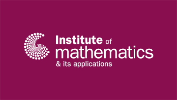

> We are excited to share news from one of our key partners, the Institute of Mathematics and its Applications (IMA), which has today launched an exciting new collaboration with the Royal Academy of Engineering (RAEng) and Levelling Up: STEM.

<!--more-->

This alliance is aimed at enhancing engineering education and broadening participation with three goals:
* To raise awareness of engineering as a fantastic, STEM-based career.
* To raise the maths capabilities of those interested in engineering.
* To help students appreciate the relevance of maths in practical engineering situations.

The collaboration will encourage and support UK university engineering departments to deliver Levelling Up: Maths for Engineering – whereby they arrange for their undergraduates to tutor A-level Maths students in small groups.

Professor Hannah Fry HonFREng, FIMA, President of the IMA commented, “The IMA is thrilled to deepen our efforts with Levelling Up: STEM through this new collaboration with the Royal Academy of Engineering. By combining our strengths, we can enhance the support structure for students and ensure that the pathways into STEM, particularly mathematics and engineering, are robust and accessible to all.”

Read the full IMA press release [here](https://ima.org.uk/24744/ima-launches-new-stem-alliance-focused-on-improving-maths-skills-aimed-at-widening-participation-in-engineering/).

## Get Involved!

We encourage all UK university engineering departments to get involved – we are enrolling universities in Autumn 2024 for tutorials launching in Spring 2025.

You may find that other departments at your university – maths, physics, chemistry or computer science – are already offering a Levelling Up: STEM program.

The essential element is to arrange for your undergraduates to tutor A-level students in small groups. The syllabus has already been developed for a series of “engineering-flavoured” tutorials, and the operational aspects of the program already well established. This a straightforward, concrete, practical step to contribute to your widening participation efforts.

> Read about our original launch of Levelling Up: Maths for Engineering [here]()
>
> Read our post about Engineering Study in the UK [here]()
>
> Read our post about Engineering Maths Content Development [here]()

Contact us now at 

